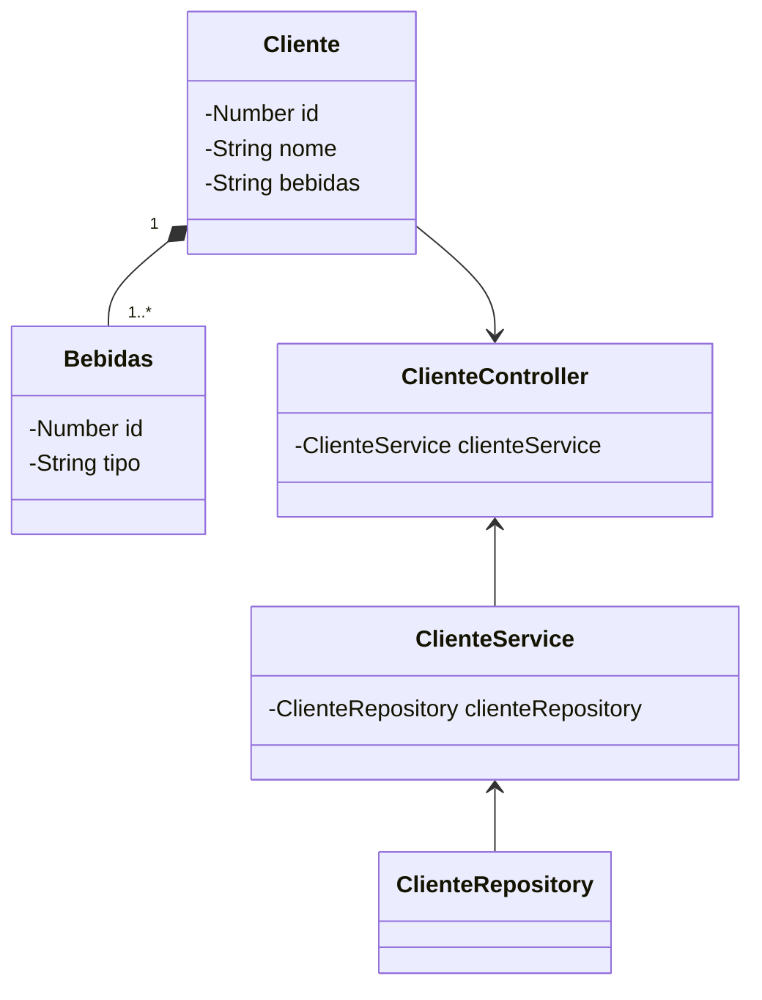

# Santander Bootcamp Java FullStack
Java API REST Full criada durante o bootcamp da Santander.

## Diagrama da classes

```mermaid
  classDiagram
  class Cliente {
    -Number id
    -String nome
    -String bebidas
  }

  class Bebidas {
    -Number id
    -String tipo
  }

  class ClienteService {
    -ClienteRepository clienteRepository
  }
  
  class ClienteController {
    -ClienteService clienteService 
  } 

  Cliente "1" *-- "1..*" Bebidas
  ClienteService <-- ClienteRepository
  ClienteController <-- ClienteService
  Cliente --> ClienteController

```
